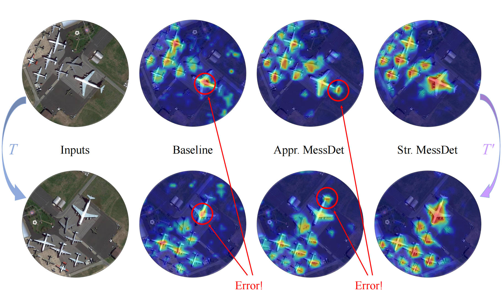

# Measuring the Impact of Rotation Equivariance on Aerial Object Detection (ICCV 2025)

Authors: [Xiuyu Wu](https://github.com/Nu1sance), [Xinhao Wang](https://github.com/wxh0121), Xiubin Zhu, Lan Yang, [Jiyuan Liu](https://liujiyuan13.github.io/), Xingchen Hu*.

*: Corresponding author.

## Introduction

This is the official implementation of *[Measuring the Impact of Rotation Equivariance on Aerial Object Detection](https://arxiv.org/abs/2507.09896)* (ICCV 2025). In this paper, we propose a novel downsampling method that preserves strict rotation equivariance in rotation-equivariant networks. We also introduce a channel attention mechanism that maintains rotation equivariance. To exploit the natural grouping property of rotation-equivariant features, we design a multi-branch head, which further reduces the model's parameter count. Based on these components, we present **MessDet**, which achieves detection performance comparable to state-of-the-art methods with significantly fewer parameters. Additionally, we analyze the variation of rotation-equivariant loss during training, demonstrating the importance of rotation equivariance in aerial object detection tasks.

<div align="center">
  
</div>

## Installation

```shell
# create environment
conda create -n messdet python=3.8 -y
conda activate messdet

# install pytorch and torchvision
conda install pytorch==2.0.1 torchvision==0.15.2 torchaudio==2.0.2 pytorch-cuda=11.8 -c pytorch -c nvidia

# install mmyolo and e2cnn
pip install -U openmim
pip install e2cnn
mim install "mmengine>=0.6.0"
mim install "mmcv==2.0.1"
mim install "mmdet==3.0.0"

git clone https://github.com/Nu1sance/MessDet
cd MessDet
pip install -r requirements/albu.txt
mim install -v -e .
```

## Models and Pretrained Backbones
### Pretrained Backbones

Appr. RE-CSPNeXt: [GoogleDrive](https://drive.google.com/file/d/1J8EulR5CUljk8-Uc5k7LMNMD84le6dwm/view?usp=sharing) / [BaiduCloud](https://pan.baidu.com/s/162NgoL3VtPpCz9GQGjJA4A?pwd=72dj)

Str. RE-CSPNeXt: [GoogleDrive](https://drive.google.com/file/d/1RgXEbaMPtTheSTVgNh2DvQgydDknK4b4/view?usp=sharing) / [BaiduCloud](https://pan.baidu.com/s/1wiGYDRlHJe6DGdm8ZupFJw?pwd=ftdh)

### Models on DOTA-v1.0

|     Model     |  mAP  |                            Config                            |                                                                                  Download                                                                                  |
| :-----------: | :---: | :----------------------------------------------------------: |:--------------------------------------------------------------------------------------------------------------------------------------------------------------------------:|
| Appr. MessDet | 78.45 | [messdet_appr_4xb2-36e_dota](https://github.com/Nu1sance/MessDet/blob/main/configs/messdet/messdet_appr_4xb2-36e_dota.py) | [GoogleDrive](https://drive.google.com/file/d/1w-Q2ZS1z7iRaTqkpvnaodX_-wDgyyYL5/view?usp=sharing) / [BaiduCloud](https://pan.baidu.com/s/1lRBxl3-8ETvnxpqKgbvmOw?pwd=awn7) |
| Str. MessDet  | 79.12 | [messdet_str_4xb2-36e_dota](https://github.com/Nu1sance/MessDet/blob/main/configs/messdet/messdet_str_4xb2-36e_dota.py) | [GoogleDrive](https://drive.google.com/file/d/1KvoDLuII3lGTn9aOe1X73ef_u_pMYmsU/view?usp=sharing) / [BaiduCloud](https://pan.baidu.com/s/1unU0fhGh99BtJw5rvA-tpg?pwd=6zn7) |

### Models on DOTA-v1.5

|     Model     |  mAP  |                            Config                            |                                                                                  Download                                                                                  |
| :-----------: | :---: | :----------------------------------------------------------: |:--------------------------------------------------------------------------------------------------------------------------------------------------------------------------:|
| Appr. MessDet | 72.38 | [messdet_appr_4xb2-36e_dota15](https://github.com/Nu1sance/MessDet/blob/main/configs/messdet/messdet_appr_4xb2-36e_dota15.py) | [GoogleDrive](https://drive.google.com/file/d/1W92Xrg2y6xCVNeomSKQRVxMMnNNh_jSG/view?usp=sharing) / [BaiduCloud](https://pan.baidu.com/s/1L8b0rc-nMucoTi5GdgmUYA?pwd=b6ie) |
| Str. MessDet  | 73.14 | [messdet_str_4xb2-36e_dota15](https://github.com/Nu1sance/MessDet/blob/main/configs/messdet/messdet_str_4xb2-36e_dota15.py) | [GoogleDrive](https://drive.google.com/file/d/1pCTV8Aq-QIIJu0MdynGGsuxunD4u8oxc/view?usp=sharing) / [BaiduCloud](https://pan.baidu.com/s/1TaU46Ga8O5YRQZiyL8tMPA?pwd=ih46) |


## Usage
Please refer to the official [MMYOLO](https://mmyolo.readthedocs.io/en/latest/) documentation for detailed information, including essential instructions on training, testing, and more.

In addition, we provide a script to verify strict rotation equivariance, located at messdet/tools/check_rotation_equivariant.py. Users can run it to observe the equivariance error.

## Acknowledgement

Our code is based on [MMYOLO](https://github.com/open-mmlab/mmyolo), [MMRotate](https://github.com/open-mmlab/mmrotate), and [ReDet](https://github.com/csuhan/ReDet). We sincerely appreciate their outstanding contributions.

## Contact
If you have any questions, please feel free to contact us at [xiuyuwu@stu.xidian.edu.cn](mailto:xiuyuwu@stu.xidian.edu.cn). We would be more than happy to assist you!
